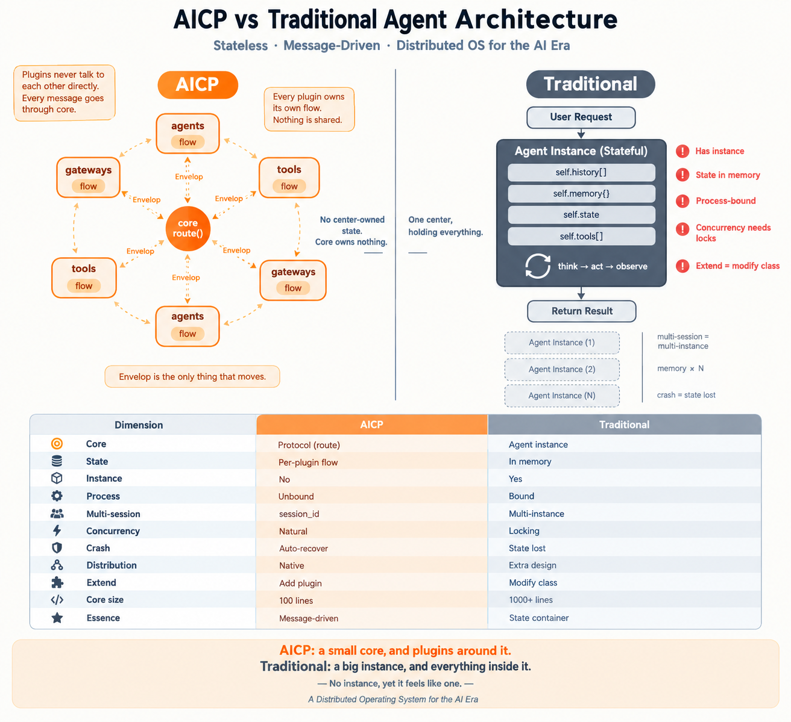

<p align="center">
  <h1 align="center">AICP Protocol / AICP 协议</h1>
  <strong>Agent Interaction & Communication Protocol .</strong>
  <br>
  <em>Agent 交互与通信协议。</em>
  <br>
  <em>No middleware. No scheduler. No state machine. No framework. </em>
  <br>
  <em>没有中间件。没有调度器。没有状态机。没有框架。</em>
  <br>
  <em>Don't believe it? Try it yourself.</em>
  <br>
  <em>不信？你试试。</em>
</p>

<p align="center">
  <a href="https://github.com/woozheng/aicp-eat"></a>
  <a href="./AICP_Protocol_v5.3.md"></a>
  <a href="https://github.com/woozheng/aicp-eat/blob/main/LICENSE"></a>
  <a href="https://github.com/woozheng/aicp-raw-experiments"></a>
</p>

---
## AICP VS Traditional Agent Architecture

<p align="center">
  
</p>

## Projects Based on the AICP Protocol / 基于 AICP 协议的实现项目

| Project / 项目 | Language / 语言 | Description / 说明 |
|------|------|------|
| **[aicp-Engine](https://github.com/woozheng/aicp_engine)** | Python | AICP protocol super engine. AI self-orchestrates, directly generates applications. Human needs are the goal. Code and tools are byproducts. / AICP 协议超级引擎，AI自编排，直接生成应用。以人类需求为目标。代码工具都是副产品 |
| **[aicp-cli](https://github.com/woozheng/aicp_cli)** | Python | Protocol-driven LLM runtime CLI. The world's smallest execution-oriented AI CLI. 2000+ lines, 8 files, cross-platform. / 协议驱动的 LLM 运行时 CLI，世界最小需求执行型 AI CLI，2000+ 行代码，8 个文件，跨平台 |
| **[aicp-js-engine](https://github.com/woozheng/aicp-js-engine)** | JavaScript | Pure frontend JS agent engine, runs natively in the browser. LLM generates code → sandbox execution → real-time rendering. Zero dependencies. Zero build. / 纯前端 JS 智能体引擎，浏览器原生运行。LLM 生成代码 → 沙箱执行 → 实时渲染。零依赖，零构建 |
| **[aicp-eat](https://github.com/woozheng/aicp-eat)** | Python/Go/Rust | Consume everything: Python libraries, Go libraries, Rust libraries, exposed as HTTP APIs. AI can curl anything. / 吞噬一切：Python 库、Go 库、Rust 库，暴露为 HTTP API，AI 一切皆可 curl |
| **[aicp-shell](https://github.com/woozheng/aicp_shell)** | Flutter | Consume 7-platform hardware capabilities in a WebView container. No native development needed. Hardware exposed as JS APIs. AI can JS everything. / 吞噬 7 平台硬件能力的 WebView容器，无需任何原生开发，将本地硬件系统能力暴露为页面API，AI 一切皆可 JS |
| **[aicp-review-bot](https://github.com/woozheng/aicp-review-bot)** | Go | Automated GitHub code review bot, generated by an AICP-protocol-based Go engine AI. / 自动 GitHub 代码审查机器人，由基于 AICP 协议的 Go 引擎的AI 自动生成 |
| **[biopoiesis](https://github.com/woozheng/biopoiesis)** | Python | Early AICP prototype. The smallest multi-agent collaboration framework. The foundation from which the AICP protocol was abstracted. / AICP 早期构建项目，最小的多智能体协作框架，AICP 协议抽象的基础 |

---
## AICP Protocol Ecosystem    
```text
┌─────────────────────────────────────────────────────────────────────────┐
│                          AICP Protocol Core Layer                       │
│              Envelop Packet + Agent Runtime + Plugin Manager + route()  │
│                      Standard Spec (Fixed 100 Lines Core Spec)          │
└─────────────────────────────────────────────────────────────────────────┘
                                      │
              ┌───────────────────────┼───────────────────────────────┐
              ▼                       ▼                               ▼
┌───────────────────────┐    ┌────────────────────────┐    ┌────────────────────────┐
│     aicp-engine       │    │     aicp-js-engine     │    │      aicp-shell        │
│        Python Stack   │    │    JavaScript Runtime  │    │     Flutter Cross UI   │
├───────────────────────┤    ├────────────────────────┤    ├────────────────────────┤
│ • HTTP REST Server    │    │ • LLM Native Executor  │    │ • WebView JS Bridge    │
│ • aicp-cli Core API   │    │ • new Function Sandbox │    │ • Hardware Native API  │
│ • aicp-eat Data Layer │    │ • Canvas / DOM Render  │    │ • Camera / BLE Module  │
│ • Global Plugin Sys   │    │ • Remote LLM Fetch SDK │    │ • GPS / FS / Audio I/O │
│ • Studio Dev API      │    │ • hardware.js Adapter  │◄──►│ Cross Hardware Driver  │
│ • Docker Containerize │    │ • Any Browser Support  │    │ • 7 Full Platforms     │
└───────────────────────┘    └────────────────────────┘    └────────────────────────┘

# Local Quick Entry (Unified Access Portal)
Entry Point: aicp-cli Command Tool | Any Modern Browser (Cross Platform)

```

## Papers / 论文集

| Paper / 论文 | Link / 链接 |
|---|---|
| AICP Protocol v5.4 / 协议正文 | [AICP_Protocol_v5.4.md](./docs/AICP_Protocol_v5.4.md) |
| Protocol as Neural: A New AGI Paradigm / 协议即神经，AGI新范式 | [paper](./papers/[AICP]协议即神经：迈向以协议为中心的通用人工智能操作系统.md) |
| AICP vs Claude Code & Codex / AICP与Claude Code、Codex范式对比 | [paper](./papers/[AICP]自演化代码智能体架构——与Claude_Code、OpenCode范式对比研究.md) |
| How AICP Develops Code Agents / AICP如何开发代码智能体 | [paper](./papers/[AICP]%20开发同类代码智能体产品.md) |
| A New Human-Machine Collaboration Paradigm / AICP人机协作新范式 | [paper](./papers/[AICP]%20统一消息协议的人机协同架构新范式.md) |
| Cross-Domain Research / AICP跨领域研究 | [paper](./papers/[AICP]全域跨学科计算仿真底层架构研究.md) |
| Enterprise Digital Employee Foundation / AICP企业数字员工新基座 | [paper](./papers/[ACP}]面向企业数字员工的协同与隔离双模式架构.md) |

---

## Past Experiments / 过往实验 🧪

**AI read the protocol. Human said one line. AI generated these systems.**
**AI 读了协议。人类说了一句。AI 生成了这些系统。**

| Human Said / 人类说 | AI Generated / AI 生成 | Link / 链接 |
|---|---|---|
| 🖥️ Microkernel OS / 微内核 | Process, memory, FS, IPC, scheduler | [aicp-os-kernel](https://github.com/woozheng/aicp-os-kernel) |
| ⚛️ Quantum simulator / 量子模拟 | Qubits, gates, Shor code, VQE | [aicp-quantum](https://github.com/woozheng/aicp-quantum) |
| 🧬 Protein folding / 蛋白质折叠 | 50 MD Agents, live-letter jump | [aicp-protein](https://github.com/woozheng/aicp-protein) |
| 🏋️ LLM training / 大模型训练 | 3D parallel, All-Reduce, ZeRO | [aicp-llm-trainer](https://github.com/woozheng/aicp-llm-trainer) |
| 📐 Riemann Hypothesis / 黎曼猜想 | Riemann-Siegel, Montgomery, GUE | [aicp-riemann](https://github.com/woozheng/aicp-riemann) |
| 💾 AI chip / AI 芯片 | ISA, compiler, chiplet interconnect | [aicp-ai-chip](https://github.com/woozheng/aicp-ai-chip) |

**No domain training data. No framework documentation. Just the protocol.**
**没有领域训练数据。没有框架文档。只有协议。**

---

## 💀 The protocol is the soul. Code is the body. / 协议是灵魂，代码是肉身。

**AICP defines "how the world works."**
**AICP 协议定义"世界怎么运转"。**

**The projects prove "how the world is built."**
**实现项目证明"世界怎么搭建"。**

**AI reads the protocol → AI understands → AI generates systems → AI controls hardware**
**AI 读协议 → AI 理解 → AI 生成系统 → AI 控制硬件**

**This is AICP. (AI-centric Protocol. A new generation of AI development paradigm.)**
**这就是 AICP。(以AI为中心的协议，新一代AI开发范式)**

---

[MIT](LICENSE) · Dvwoo